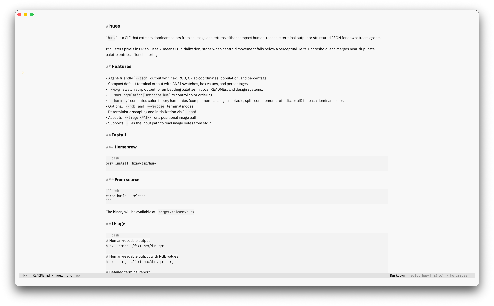
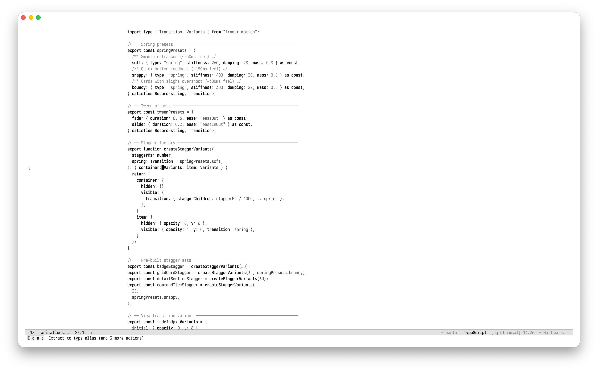
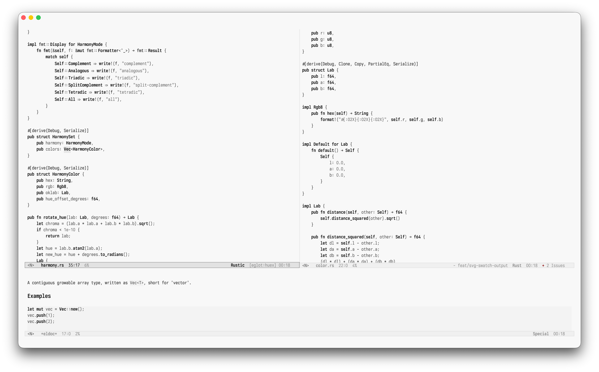
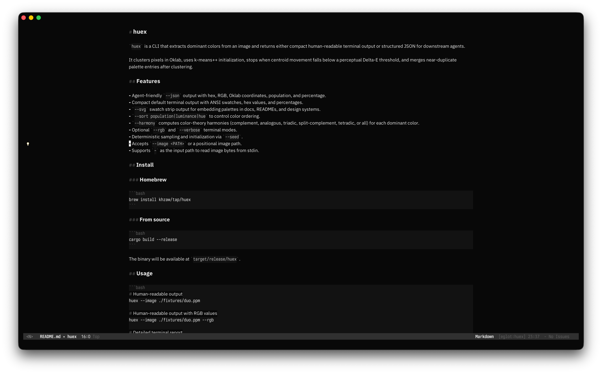
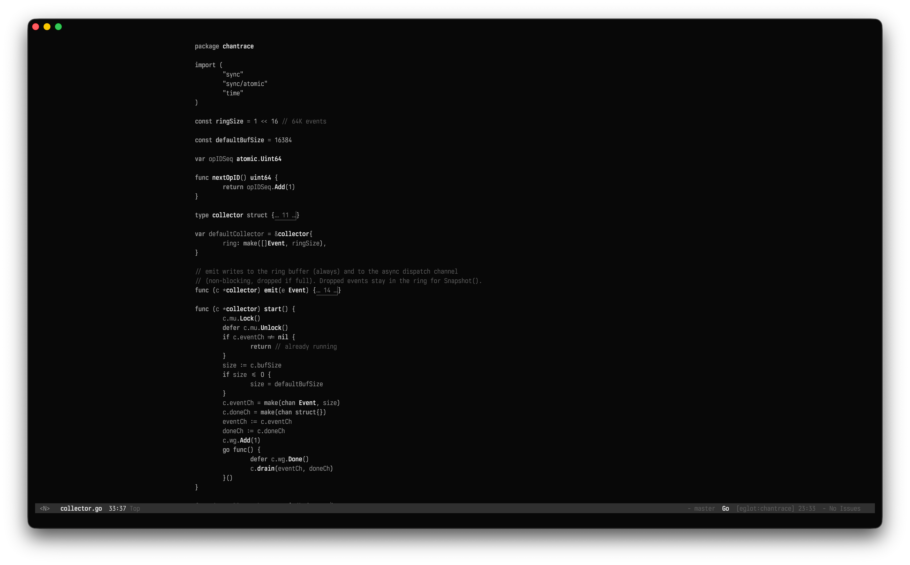
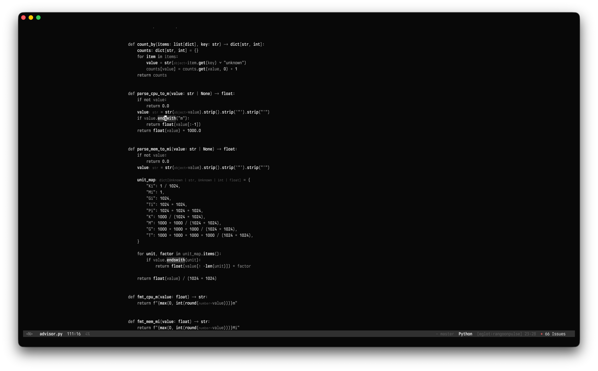
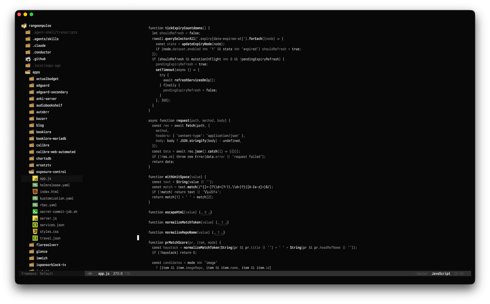
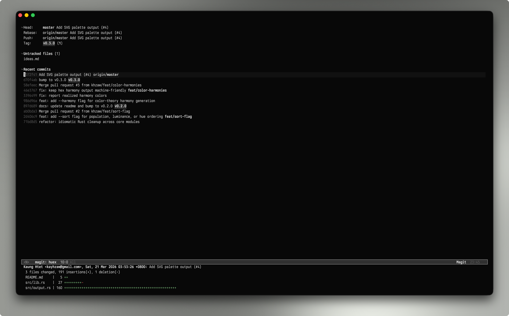
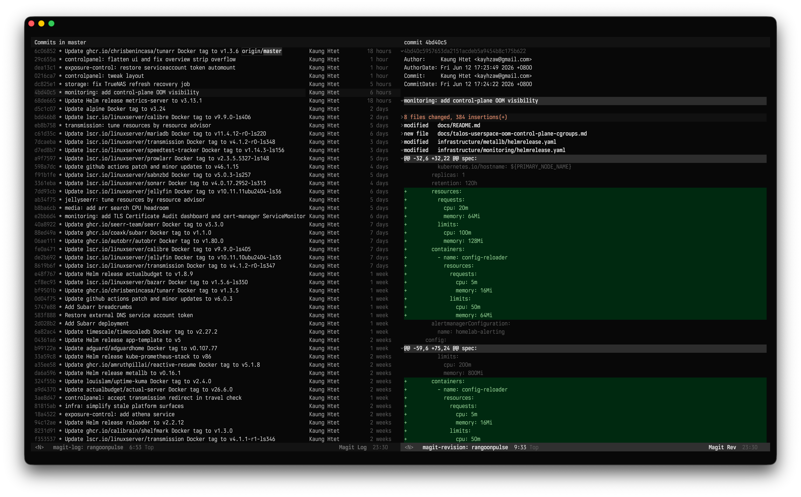
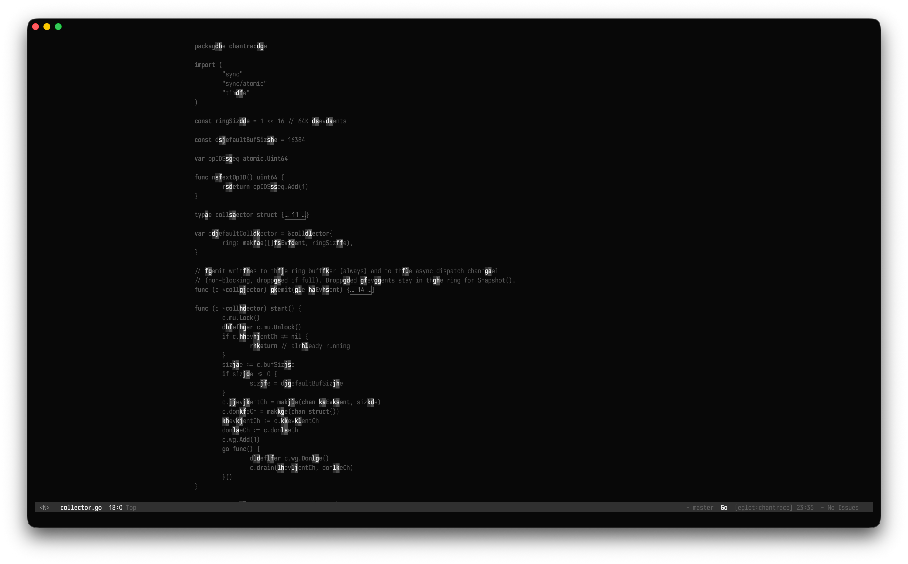

# Ivory Themes

Ivory is a minimal, near-monochromatic Emacs theme package with two variants:

- `ivory-light`
- `ivory-dark`

Most syntax contrast comes from weight, foreground intensity, and background
surfaces.  Git and diff faces keep red/green directionality by default.

## Installation
### `use-package` With `:vc`

```elisp
(use-package ivory-themes
  :vc (:url "https://github.com/khzaw/ivory-themes.git"
       :rev :newest)
  :custom
  (ivory-themes-bold-constructs t)
  (ivory-themes-italic-constructs nil)
  :config
  (load-theme 'ivory-light t))
```

### Straight.el

```elisp
(use-package ivory-themes
  :straight (:type git
             :host github
             :repo "khzaw/ivory-themes")
  :custom
  (ivory-themes-bold-constructs t)
  (ivory-themes-italic-constructs nil)
  :config
  (load-theme 'ivory-dark t))
```

### Elpaca

```elisp
(use-package ivory-themes
  :elpaca (:host github
           :repo "khzaw/ivory-themes")
  :custom
  (ivory-themes-bold-constructs t)
  (ivory-themes-italic-constructs nil)
  :config
  (load-theme 'ivory-light t))
```

## Options

Set options before loading or reloading a theme.

```elisp
(setq ivory-themes-bold-constructs t      ; bold for syntax/content emphasis
      ivory-themes-italic-constructs nil  ; italics where conventional
      ivory-themes-soft-backgrounds nil)  ; pure white/black editor backgrounds
```

| Option | Default | Effect |
| --- | --- | --- |
| `ivory-themes-bold-constructs` | `t` | Bold weight for syntax/content emphasis; structural UI chrome (modelines, selection/match rows, Magit, diagnostics, top-level headings) stays bold regardless. |
| `ivory-themes-italic-constructs` | `nil` | Allow italics in faces that conventionally use them. |
| `ivory-themes-soft-backgrounds` | `nil` | Replace the pure white/black editor background with a slightly softened one. |

### Softened backgrounds

By default `ivory-light` uses pure white and `ivory-dark` uses pure black for
the editor background.  Enable `ivory-themes-soft-backgrounds` to take the edge
off that contrast — `ivory-light` shifts to `#f8f8f8` and `ivory-dark` to
`#080808`, along with matching adjustments to adjacent surfaces.

```elisp
(setq ivory-themes-soft-backgrounds t)
(ivory-themes-load 'ivory-light)
```

You can also flip it without restarting Emacs:

```elisp
(ivory-themes-toggle-soft-backgrounds)
```

## Toggling between light and dark

```elisp
(ivory-themes-toggle)
```

## Palette System

Ivory is a near-monochromatic theme, so nearly every color is a shade of gray.
The idea behind the grayscale is to describe each of those grays with a single
number instead of a hex code.

A color has three channels: red, green, and blue. Each one goes from 0 to 255.
When all three are equal, you get a gray, so one number is enough to define it.
That number is the rung on the ladder. `(gray 0)` is black, `#000000`.
`(gray 255)` is white, `#ffffff`. `(gray 138)` sits in the middle at `#8a8a8a`.

So most colors are just a name pointing at one rung on the ladder. The palette
source writes them as `(gray N)` instead of hex. To make a color lighter, you
raise the number. `(gray 138)` to `(gray 146)` is one small step up.

A few colors aren't gray, like the red and green diff faces. Those are written
as plain hex.

The readable foreground roles are kept at a contrast ratio of at least 3:1
against the background.  Primary code text sits well above that floor.  The 3:1
target is really there for the quieter text like comments, dimmed labels,
completion annotations, and inactive UI text, so those stay legible without
shouting.

### Softened backgrounds

By default the editor background sits right at the end of the ladder.
`ivory-light` puts `bg` at `(gray 255)` and `ivory-dark` puts it at `(gray 0)`.
The surfaces next to it keep a small gap from that base, so `bg-alt`,
`bg-subtle`, and inactive modelines stay visible while the editor still reads
as white or black.

If you'd rather not have a pure white or pure black background, you have two
ways to soften it.

- Turn on `ivory-themes-soft-backgrounds` (see [Options](#options)).  This
  pulls `bg` just off the end of the ladder, to `#f8f8f8` for light and
  `#080808` for dark, and moves the nearby surfaces to match.
- Override the background roles yourself (see
  [Palette Overrides](#palette-overrides)) if you want a particular tone.

Either way you stay in the same role-based system.  You set roles like
`fg-comment`, `bg-block`, or `modeline-accent`, and the grayscale notation
behind the scenes just keeps the base palette consistent.

Palette roles:

| Group | Roles |
| --- | --- |
| Backgrounds | `bg`, `bg-alt`, `bg-dim`, `bg-active`, `bg-subtle`, `bg-block`, `bg-hl`, `bg-region`, `bg-search`, `bg-modeline`, `bg-modeline-inactive` |
| Code backgrounds | `bg-code-block`, `bg-code-inline` |
| Foregrounds | `fg`, `fg-alt`, `fg-dim`, `fg-faint`, `fg-name`, `fg-syntax`, `fg-string`, `fg-comment`, `fg-comment-delimiter`, `fg-inactive` |
| UI structure | `border`, `cursor`, `modeline-accent` |
| Accents and ANSI roles | `red`, `red-faint`, `green`, `green-faint`, `yellow`, `blue` |
| Diff backgrounds | `bg-added`, `bg-added-faint`, `bg-removed`, `bg-removed-faint`, `bg-changed`, `bg-changed-faint` |
| Diff foregrounds | `fg-added`, `fg-added-intense`, `fg-removed`, `fg-removed-intense`, `fg-changed`, `fg-changed-intense` |

## Palette Overrides

Palette entries can be overridden from user configuration before loading or
reloading a theme.  The override names are the same symbols used in
`ivory-themes-palettes`.  Override values must be six-digit `#rrggbb` hex
colors.  Unknown role names signal an error instead of being ignored.

For example, tune light comments:

```elisp
(setq ivory-themes-light-palette-overrides
      '((fg-comment . "#8a8a8a")
        (fg-comment-delimiter . "#929292")))

(ivory-themes-load 'ivory-light)
```

Or make diff backgrounds stronger:

```elisp
(setq ivory-themes-light-palette-overrides
      '((bg-added . "#d5f5df")
        (bg-removed . "#ffe0de")))

(ivory-themes-load 'ivory-light)
```

Shared overrides go in `ivory-themes-common-palette-overrides`; variant-specific
overrides go in `ivory-themes-light-palette-overrides` or
`ivory-themes-dark-palette-overrides`.

## Screenshots
### Light mode

#### Markdown



#### TypeScript



#### Rust



### Dark mode

#### Markdown



#### Go



#### Python



#### JavaScript



#### Magit Status



#### Magit Log



#### Avy




## License

Ivory Themes is licensed under the MIT License.  See [LICENSE](LICENSE).
